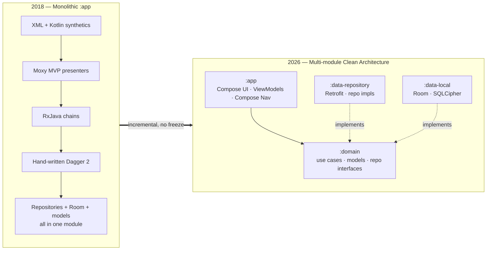
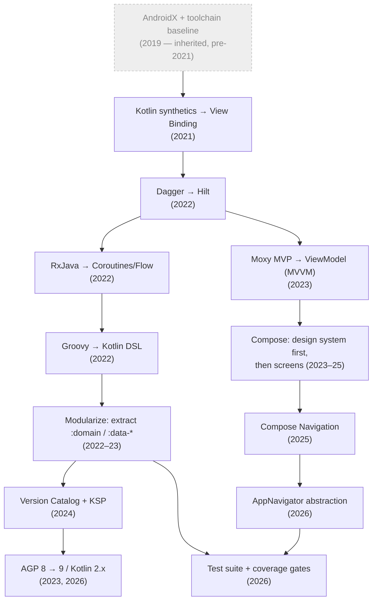

# Modernizing an 8-Year-Old Production Android App — Engineering Case Study

A production Android app — sports coaching & player development, used by coaches, players, and
families — that I helped take from a 2018-era codebase to a modern Jetpack stack, **without ever
freezing feature delivery.**

> Built for a client. The app's name, package, commit hashes, and other identifying details are
> withheld for confidentiality; everything else (scale, sequencing, code excerpts, trade-offs) is
> real and I can walk through it in detail in conversation.

> This is a case study of a long-haul modernization: the decisions, the order they had to happen
> in, the regressions they caused, and — just as importantly — the debt that still remains and how
> I'd pay it down. It's written to be read by engineers; it favors *why* over *what*.

📄 **Deep dive:** [`docs/modernization-guide.md`](docs/modernization-guide.md) — the full phase-by-phase playbook
🔍 **Self-assessment:** [`docs/lessons-and-tradeoffs.md`](docs/lessons-and-tradeoffs.md) — the debt that remains and how I'd evolve it next

---

## TL;DR

Over several years I drove the incremental migration of a large, actively-shipping Android app
across **every major layer of its stack** — UI, navigation, concurrency, DI, build system, and
architecture — using a strict *coexistence-over-rewrite* strategy so the app stayed shippable at
every commit.

| | Before (2018) | After (2026) |
|---|---|---|
| **UI** | XML + Kotlin synthetics | Jetpack Compose (~84 screens) + Material 3 |
| **Navigation** | Fragment transactions + hand-rolled nav | Compose Navigation — per-feature graph builders + navigator interfaces (one `AppNavigator`) |
| **Concurrency** | RxJava / RxJava2 | Coroutines + Flow (RxJava fully removed) |
| **Presentation** | MVP (Moxy) | MVVM (Jetpack `ViewModel` + Hilt) |
| **DI** | Hand-written Dagger 2 | Hilt |
| **Architecture** | Monolithic `:app` | Multi-module Clean Architecture (`:app` / `:domain` / `:data-repository` / `:data-local`) |
| **Build** | Groovy Gradle, support libs | Kotlin DSL + Version Catalog + KSP, AGP 9 / Kotlin 2.x / JVM 17 |
| **Testing** | Minimal | Unit (all modules) + E2E (Hilt + mock backend) + screenshot · coverage-gated in CI |

**Scale:** ~90 screens migrated · 4 modules · ~940 Kotlin source files · 8-year-old codebase ·
**~5-year modernization (2021→2026)** · zero feature freeze.

> **Scope note:** the app was born in 2018; I joined in **2021** and led the modernization from then
> on. The AndroidX/RxJava2 groundwork (2019) predates my involvement and is included below only as
> context for where the codebase started.

---

## Why this is interesting (and hard)

Most "modernization" stories are greenfield rewrites or a single framework swap. This was neither.
It was a **continuous migration of a revenue-generating app** where:

- Every change had to ship alongside ongoing feature work — no rewrite branch, no freeze.
- The migrations had **hard dependencies on each other** (you can't adopt Compose well without
  ViewModels; you can't adopt ViewModels cleanly without DI in place first).
- Each sweeping change risked **silent regressions**, not just compile errors — the kind that pass
  code review and surface in production.

The interesting engineering is in the **sequencing and the coexistence strategy**, not any single
library swap.

---

## Architecture: before → after

## The migration timeline (and dependency order)

The order was not arbitrary — each phase unblocked the next:

My involvement starts at the View Binding phase (2021); the 2019 baseline is shown dimmed as
inherited context.

**The dependency insight:** Hilt before ViewModels (so they're `@HiltViewModel` from birth) →
ViewModels before Compose (Compose needs state owners) → design system before screen migration →
host-independent composables before navigation → navigation before the navigation abstraction.

---

## Three decisions I'd highlight in an interview

### 1. Coexistence over big-bang
The whole program was possible only because old and new systems ran side by side until the old one
could be deleted in a single clean commit. View Binding lived next to synthetics; Compose next to
XML (`viewBinding = true` *and* `compose = true` for ~2 years); Coroutines next to RxJava. **The old
mechanism was deleted dead-last, only once nothing referenced it.** This is what kept the app
shippable across ~5 years of continuous migration.

### 2. Design system *before* screens
The first Compose screens (2023) were slow to build because nothing was shared. Before going wide, I
established a Compose theme bridged to the existing XML resources and a reusable `BaseScreen`
scaffold (loading, global error handling, lifecycle, snackbar). Everything after that accelerated
sharply. **Build the leverage before you scale the migration.**
→ See [`snippets/BaseScreen.kt`](snippets/BaseScreen.kt).

### 3. Abstract the framework at the boundary
On Compose Navigation, I put per-feature navigator interfaces (composed into one `AppNavigator`) in
front of the raw `NavController`, so screens depend on a typed, testable, swappable API instead of
framework internals — and kept each feature's destinations in their own `NavGraphBuilder` file behind
a thin `AppNavHost` assembler.
→ See [`snippets/AppNavigator.kt`](snippets/AppNavigator.kt).

---

## The regression that didn't show up in code review

The RxJava → Coroutines migration is the story I'd tell to demonstrate depth. A 1:1 translation of
`Observable` chains to `suspend` functions **compiles, passes review, and works** — but silently
**serializes calls that RxJava's `zip`/`merge` had run concurrently**. The fix was restoring
explicit concurrency with `async`/`awaitAll` on every multi-source screen.

The lesson: a "translate each call site" migration is *correctness-complete but not
performance-complete*. You have to re-derive **semantics** (concurrency, error handling,
cancellation), not just syntax. This class of bug is why the modernization closed with a
characterization-test layer on exactly those hotspots — use-case tests in `:domain`, ViewModel tests
(MockK + Turbine) in `:app`, and E2E on the critical flows — so a regression like this one fails a
test instead of shipping. → See [`snippets/testing.kt`](snippets/testing.kt)

---

## What I'd do differently / evolve next

Senior work isn't just shipping the migration — it's having a clear-eyed view of where it's still
weak. The full register is in [`docs/lessons-and-tradeoffs.md`](docs/lessons-and-tradeoffs.md); the headline items:

- **Navigation passes whole domain objects as Gson-JSON inside route strings.** It unblocked the
  Compose Nav migration but it's a known smell — decode failures are caught and reported to
  Crashlytics (it fails in production and falls back to empty objects). The fix is type-safe routes
  / passing IDs and re-fetching. → [`snippets/navigation-tradeoff.md`](snippets/navigation-tradeoff.md)
- **Cross-cutting events run through process-global singletons** (`EventBus`, `SnackbarController`).
  The implementation is fine — a lifecycle-aware `SharedFlow` — but the scope is broad; I'd move
  screen-local events to per-ViewModel channels and reserve a global bus for truly app-wide signals.

I treat this honesty as a feature of the portfolio, not a liability: it's the part that shows
engineering judgment.

---

## Skills this work demonstrates

`Kotlin` · `Jetpack Compose` · `Compose Navigation` · `Coroutines & Flow` · `Hilt / Dagger` ·
`Clean Architecture & modularization` · `MVVM` · `Room` · `Retrofit / OkHttp` · `Gradle (Kotlin DSL,
Version Catalogs, KSP)` · `R8 / ProGuard` · `AGP & toolchain upgrades` · `incremental migration
strategy` · `production debugging` · `testing (unit · E2E · screenshot) & coverage gating` ·
`technical writing & decision documentation`

---

## A note on scope & credit

The app was built and maintained by a small team over its lifetime, beginning in 2018. **I
joined the project in 2021 and led the modernization work described here (2021→2026)**, with the
majority of the codebase's commits in this period. The AndroidX/RxJava2 groundwork (2019) predates
me and is included only as starting-point context. Where work reflects team contributions, I've
tried to describe the *engineering* rather than overclaim individual ownership. I'm happy to walk
through specific commits, decisions, and trade-offs in detail — they come up in interviews
regularly, which is part of why I wrote this down. (Commit references are redacted here for
client confidentiality, but the history is available to walk through live.)
